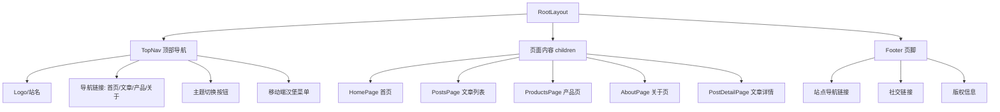

# 技术设计文档：个人网站全面重新设计

## 概述

本设计文档描述 GeGarron 个人网站的全面视觉与布局重构方案。核心目标是将当前"过度 AI 化"的模板风格（毛玻璃、渐变球、英文 kicker、超大圆角）转变为一个简洁、有个人辨识度的中文自媒体站点。

技术栈保持不变：Next.js App Router + TailwindCSS + next-themes + Noto Sans SC / Noto Serif SC。重构范围限定在视觉层和布局层，不涉及数据层（Markdown 文章系统、API 路由）和基础设施层（SEO、Analytics、sitemap）的改动。

### 设计决策与理由

| 决策 | 选择 | 理由 |
|------|------|------|
| 布局模式 | 顶部导航 + 单栏内容 | 中文阅读习惯偏好单栏聚焦，侧边栏在移动端体验差 |
| 内容最大宽度 | 768px（正文）/ 960px（列表页） | 中文排版最佳阅读宽度约 35-45 字/行 |
| 卡片圆角 | 8px-12px | 去除模板感，更接近主流中文内容站点风格 |
| 移动端导航 | 汉堡菜单 | 四个导航项适合折叠，底部导航更适合高频操作的 App |
| 页脚 | 全局 Footer 组件 | 补充站点导航、社交链接和版权信息 |

## 架构

### 当前架构问题

```
当前布局：
┌─────────────────────────────────┐
│  渐变装饰球 (absolute positioned) │
├──────────┬──────────────────────┤
│ Sidebar  │  glass-card 内容区    │
│ (固定)    │  (毛玻璃 + 大圆角)    │
│ 272-300px│                      │
├──────────┴──────────────────────┤
│          无页脚                  │
└─────────────────────────────────┘
```

### 目标架构

```
目标布局：
┌─────────────────────────────────┐
│  TopNav (logo + 导航 + 主题切换)  │
├─────────────────────────────────┤
│                                 │
│     单栏内容区 (max-w 768-960px) │
│     纯色卡片 / 无卡片包裹         │
│     小圆角 (8-12px)              │
│                                 │
├─────────────────────────────────┤
│  Footer (导航 + 社交 + 版权)      │
└─────────────────────────────────┘
```

### 页面结构 Mermaid 图



## 组件与接口

### 需要新建的组件

#### 1. TopNav 顶部导航组件

文件：`src/components/TopNav.tsx`

```typescript
// 客户端组件（需要 usePathname、useTheme）
type TopNavProps = {}

// 职责：
// - 展示站名/Logo（左侧）
// - 桌面端：水平导航链接（中部或右侧）
// - 主题切换按钮
// - 移动端：汉堡菜单按钮 + 展开的导航面板
// - 使用 defaultNavItems 配置
// - sticky 定位在页面顶部
```

#### 2. Footer 页脚组件

文件：`src/components/Footer.tsx`

```typescript
// 服务端组件
type FooterProps = {}

// 职责：
// - 站点导航链接（复用 defaultNavItems）
// - 社交链接（复用 socialLinks from infoConfig）
// - 版权信息（© {year} {name}）
// - 简洁的分栏布局，移动端堆叠
```

### 需要修改的文件

| 文件 | 改动类型 | 说明 |
|------|----------|------|
| `src/app/layout.tsx` | 重构 | 引入 TopNav + Footer，移除 Sidebar 的全局依赖 |
| `src/app/globals.css` | 重构 | 移除 glass-card/kicker/装饰球样式，重建色彩和排版变量 |
| `src/app/page.tsx` | 重写 | 单栏布局，移除 Sidebar 引用，简化区块结构 |
| `src/app/posts/page.tsx` | 重写 | 单栏布局，简化文章列表样式 |
| `src/app/posts/[slug]/page.tsx` | 重写 | 单栏阅读布局，TOC 改为文章顶部或可选侧边 |
| `src/app/products/page.tsx` | 重写 | 单栏布局，移除筛选按钮和 highlights |
| `src/app/about/page.tsx` | 重写 | 文字排版为主，减少照片画廊 |
| `src/components/Sidebar.tsx` | 删除或废弃 | 不再使用侧边栏布局 |
| `src/components/Breadcrumb.tsx` | 微调 | 适配新的色彩变量 |

### 需要保持不变的文件

- `src/lib/posts.ts` — 文章解析逻辑
- `src/app/api/` — API 路由
- `src/config/infoConfig.ts` — 数据配置（可能微调字段但不改结构）
- `src/config/nav.ts` — 导航配置
- `src/app/providers.tsx` — ThemeProvider
- `src/app/robots.ts`、`src/app/sitemap.ts` — SEO
- `src/components/analytics/` — 分析组件
- `src/components/seo/` — SEO 组件

## 数据模型

本次重构不涉及数据模型变更。现有数据结构完全保留：

### 现有数据结构（不变）

```typescript
// PostMeta — 文章元数据
type PostMeta = {
  slug: string
  title: string
  date: string
  excerpt: string
  cover?: string
  tags: string[]
  readingTime: string
}

// ProjectItemType — 产品项目
type ProjectItemType = {
  name: string
  description: string
  link: { href: string; label: string }
  logo?: string
  category?: string[]
  tags?: string[]
  techStack?: string[]
}

// 导航项
type NavItem = { label: string; href: string }
```

### CSS 变量系统（重构）

```css
:root {
  /* 保留的变量（可能调整值） */
  --page-bg: #f5f0e8;        /* 暖白纸色 */
  --ink: #1c1b19;             /* 正文色 */
  --muted: #6b6560;           /* 辅助文字，提高对比度 */
  --accent: #a0522d;          /* 降低饱和度的暖棕色 */
  --accent-soft: rgba(160, 82, 45, 0.1);
  --line: rgba(31, 28, 24, 0.1);
  
  /* 新增/替换的变量 */
  --card-bg: #ffffff;         /* 纯色卡片背景，替代毛玻璃 */
  --card-bg-alt: #faf7f2;    /* 备选卡片背景 */
  --nav-bg: rgba(245, 240, 232, 0.95); /* 导航栏背景 */
  
  /* 移除的变量 */
  /* --panel, --panel-solid, --page-bg-soft 不再需要 */
}

.dark {
  --page-bg: #111111;
  --ink: #e8e4dc;
  --muted: #9a958e;
  --accent: #d4915a;
  --card-bg: #1a1a1a;
  --card-bg-alt: #1f1f1f;
  --nav-bg: rgba(17, 17, 17, 0.95);
}
```

### 排版系统（重构）

```css
/* 字号层级 */
--text-xs: 0.75rem;    /* 12px - 标签、辅助信息 */
--text-sm: 0.875rem;   /* 14px - 次要文字 */
--text-base: 1rem;     /* 16px - 正文基准 */
--text-lg: 1.125rem;   /* 18px - 小标题 */
--text-xl: 1.5rem;     /* 24px - 页面标题 */
--text-2xl: 2rem;      /* 32px - 首页主标题 */

/* 行高 */
正文行高: 1.75 (28px at 16px base)
标题行高: 1.3
```


## 正确性属性

本次重构属于 UI 视觉与布局重新设计，不涉及数据转换、解析、序列化等纯函数逻辑。根据属性测试适用性评估：

- 改动范围：CSS 变量、组件 JSX 结构、TailwindCSS 类名、布局方式
- 不涉及：数据模型变更、业务逻辑变更、API 变更

**属性测试（PBT）不适用于本特性。** UI 布局和视觉重构应使用快照测试、视觉回归测试和手动验收测试来验证。

## 错误处理

### 需要关注的错误场景

| 场景 | 处理方式 |
|------|----------|
| 移动端导航菜单状态管理 | 使用 React state 控制展开/收起，点击导航链接后自动关闭菜单 |
| 主题切换闪烁 | 保持现有 `suppressHydrationWarning` + `disableTransitionOnChange` 策略 |
| 图片加载失败 | 保持现有的 fallback 占位符逻辑 |
| 空文章列表 | 保持现有的空状态提示 |
| 搜索无结果 | 保持现有的友好提示信息 |
| 响应式断点过渡 | 使用 TailwindCSS 断点确保平滑过渡，避免布局跳动 |

### 向后兼容性

- 所有现有 URL 路径保持不变（`/`、`/posts`、`/posts/[slug]`、`/products`、`/about`）
- API 路由不变（`/api/posts`、`/api/posts/[slug]`）
- Markdown 文章系统不变
- SEO 元数据不变
- Analytics 集成不变

## 测试策略

### 为什么不使用属性测试

本特性是纯 UI/CSS 重构，所有验收标准都涉及视觉表现和布局结构，不涉及可以用 "for all inputs X, property P(X) holds" 表达的逻辑。具体原因：

1. **需求 1-6**：视觉元素的移除/替换、布局结构变更 — 属于 UI 渲染范畴
2. **需求 7**：排版和色彩系统 — 属于 CSS 配置范畴
3. **需求 8**：响应式设计 — 属于 CSS 媒体查询范畴
4. **需求 9**：功能完整性保持 — 属于回归测试范畴

### 推荐测试方案

#### 1. 手动验收测试（主要）

每个需求的验收标准逐条人工验证：
- 在浏览器中检查装饰元素是否已移除
- 验证布局结构是否符合设计
- 在不同视口宽度下测试响应式行为
- 切换亮色/暗色模式验证主题支持

#### 2. 构建验证测试

```bash
# 确保重构后项目能正常构建
pnpm build

# 确保无 TypeScript 类型错误
pnpm lint
```

#### 3. 功能回归测试（需求 9）

手动验证以下功能点：
- Markdown 文章能正常渲染
- 文章搜索和分页功能正常
- 主题切换功能正常
- 所有页面路由可访问
- 外部链接在新标签页打开
- SEO 元数据正确输出

#### 4. 响应式测试矩阵

| 视口宽度 | 测试点 |
|----------|--------|
| 320px | 最小移动端，无水平溢出，文字可读 |
| 375px | iPhone SE 尺寸 |
| 768px | 平板/导航断点切换 |
| 1024px | 小桌面 |
| 1440px | 大桌面 |

#### 5. 对比度验证

使用浏览器开发者工具或在线工具验证：
- 正文文字与背景对比度 ≥ 4.5:1（WCAG AA）
- 亮色模式和暗色模式分别验证
